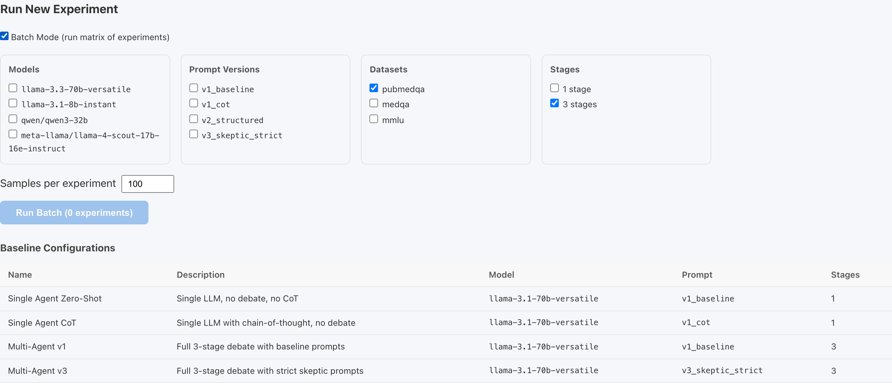
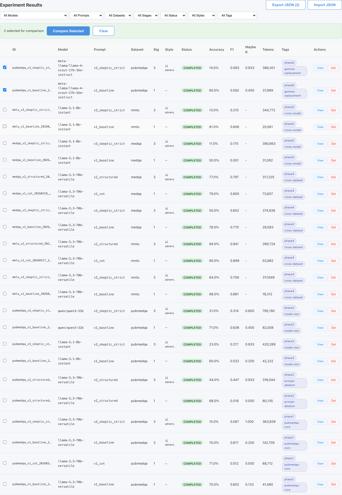
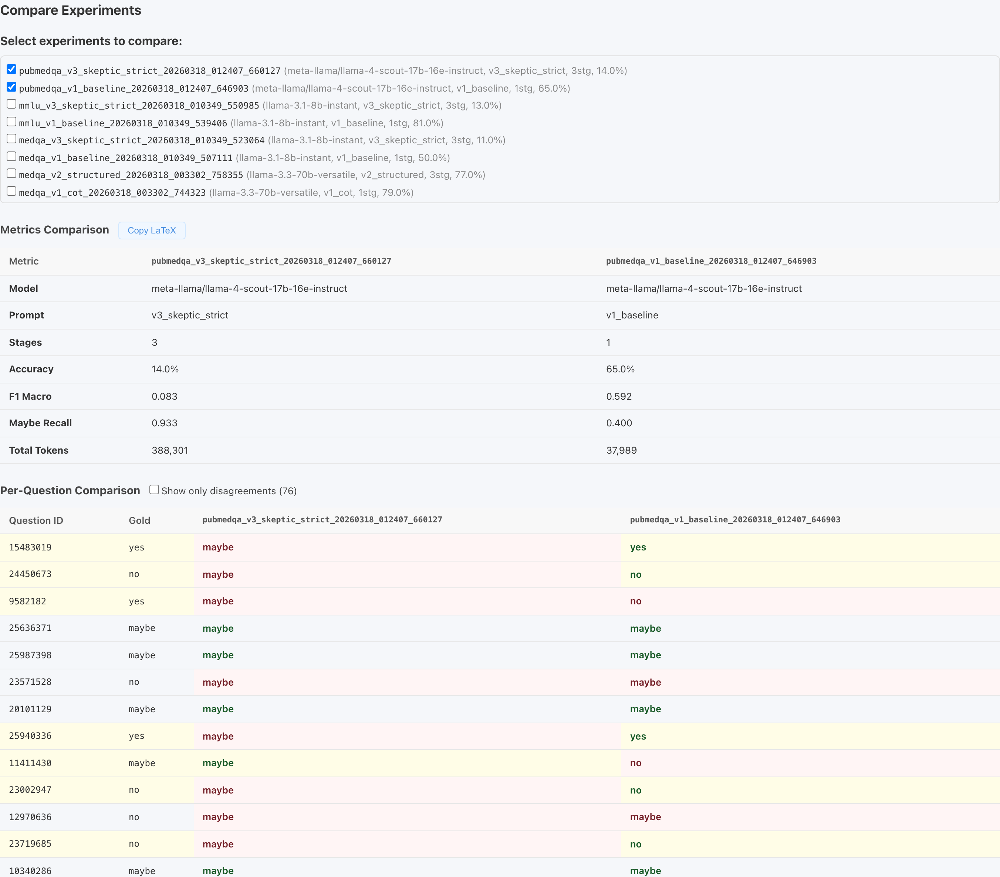

<!-- Slide 1: Title -->

# Multi-Agent Adversarial Debate for Ambiguous Biomedical QA

**AI6127 — Deep Neural Networks for NLP: Final Project**

---

**Team Members**

| Name | Role |
|------|------|
| Yu Taek Lee | Full-stack research platform (backend, frontend, experiment tracking) |
| Amruta | PubMedBERT fine-tuning (3 dataset-specific models, weighted loss) |
| Rashmi | Evaluation framework, statistical significance analysis |
| Swarangi | Multi-model role ablations (heterogeneous debate configurations) |
| Ananya | Literature Review and heterogeneous debate configuration |

---

<!-- Slide 2: Abstract / Motivation -->

# Abstract & Motivation

**Problem:** LLMs exhibit systematic overconfidence on medical QA — forcing definitive answers when evidence is ambiguous, or hedging when evidence is clear.

**Why it matters:** PubMedQA requires interpreting statistical evidence where the correct answer is often **"maybe"** — evidence is insufficient or contradictory. Errors carry clinical consequences.

**Our approach:** A **Generator → Skeptic → Judge** multi-agent debate pipeline where:
- Generator produces an initial answer
- Skeptic challenges it with statistical and logical critique
- Judge synthesizes the debate into a final decision

**Key finding:** The v6 Angel-Devil configuration reached **67% accuracy on PubMedQA**, comfortably exceeding the fine-tuned **PubMedBERT baseline of 40%** — using only prompting, no task-specific training.

---

<!-- Slide 3: Introduction -->

# Introduction

**Why is medical QA hard?**
- High-stakes task: errors have serious clinical consequences
- LLMs show impressive general QA performance but struggle with *ambiguous* evidence
- PubMedQA's "maybe" class (~**15% of samples**) is clinically critical: uncertainty is the correct medical decision when evidence is insufficient

**Why single-model approaches fall short:**
- Prompt engineering alone lacks systematic critique
- Fine-tuned models are constrained by their training distribution
- Overconfidence: models force yes/no even when evidence is genuinely ambiguous

**Research questions:**
1. Does multi-agent adversarial debate improve over single-agent prompting?
2. Can a prompting-only debate system outperform a model **trained on the task**?

---

<!-- Slide 4: Datasets -->

# Datasets

| Dataset | Task Type | Labels | Test Size | Source |
|---------|-----------|--------|-----------|--------|
| **PubMedQA** | Evidence-based QA | yes / no / maybe | 100 | HuggingFace |
| **MedQA** | USMLE-style MCQ | A / B / C / D | 100 | HuggingFace |
| **MMLU Medical** | Fact-recall MCQ | A / B / C / D | 100 | HuggingFace |

**MMLU subsets:** clinical knowledge, medical genetics, anatomy, professional medicine

---

<div class="warn-box">

**Critical challenge — PubMedQA class imbalance**

The "maybe" class represents only **~15% of samples**. Models trained or prompted without accounting for this imbalance tend toward yes/no answers, with many configurations achieving near-zero maybe recall despite reasonable overall accuracy. This is the central calibration challenge of the project.

</div>

**Evaluation uses the same code and same 100-question sampled sets** across all LLM systems — PubMedQA sampled from the train split, MedQA and MMLU from the test split. PubMedBERT was evaluated separately on the same question sets for comparison.

---

<!-- Slide 5: System Architecture -->

# System Architecture

<div class="columns">
<div>

**Standard Debate Pipeline (n_stages=3)**

```
Question
   ↓
[Generator]  ← produces initial answer
   ↓
[Skeptic]    ← challenges with critique
   ↓
[Judge]      ← synthesizes final decision
```

**Baseline (n_stages=1)**
```
Question → [Generator] → Answer
```

</div>
<div>

**v6 Angel-Devil Variant**
```
Question ──→ [Angel]  ─┐
                        ├→ [Judge] → Answer
Question ──→ [Devil]  ─┘
```
- No Generator stage
- Angel and Devil run **in parallel, no shared context**
- Judge arbitrates using an explicit evidence-quality rubric

**PubMedBERT** — evaluated externally (not integrated into platform); results compared on the same question sets

</div>
</div>

---

**Models (Groq API — OpenAI-compatible endpoint)**

| Model ID | Size |
|----------|------|
| `llama-3.3-70b-versatile` | 70B |
| `llama-3.1-8b-instant` | 8B |
| `qwen/qwen3-32b` | 32B |
| `meta-llama/llama-4-scout-17b-16e-instruct` | 17B |

**Prompt versions:** v1_baseline · v1_cot · v2_structured · v3_skeptic_strict · v5_counter_argument · v6_angel_devil

---

<!-- Slide 6: Baselines -->

# Baselines

**Classical NLP Baseline — Fine-tuned PubMedBERT**

- Pre-trained exclusively on PubMed abstracts and full-text papers
- Three separate models trained externally (Kaggle), one per dataset:
  - `SequenceClassification` head for PubMedQA (3-class: yes/no/maybe)
  - `MultipleChoice` head for MedQA and MMLU (4-option)
- **Weighted cross-entropy loss** to address maybe class imbalance → maybe recall **0.53**
- Training: Kaggle GPU T4 ×2 · lr=2e-5 · warmup ratio=0.1 · weight decay=0.01 · 5 epochs · early stopping
- Results compared offline against the same 100-question sets used by the LLM platform

---

**Prompting & Debate Baselines**

| Condition | Stages | Purpose |
|-----------|--------|---------|
| v1_baseline | 1 | Floor — direct prompt, no CoT |
| v1_cot | 1 | Isolates effect of chain-of-thought reasoning |
| v1_baseline | 3 | Isolates structural contribution of debate loop |
| v2_structured | 3 | Evidence scaffold + systematic critique checklist |
| v3_skeptic_strict | 3 | Tightened Skeptic on p-values, confounders, generalizability |
| v5_counter_argument | 3 | Skeptic argues for a specific alternative answer |
| v6_angel_devil | 3 | Angel/Devil in parallel; Judge arbitrates |

**Scale ablation:** 70B vs 8B models across same prompts

**Multi-model ablation (Swarangi):** Qwen-32B + Llama-70B swapped across Generator/Skeptic/Judge roles

---

<!-- Slide 7: Evaluation Metrics -->

# Evaluation Metrics

**47 total experiments** evaluated across 3 datasets

| Metric | Description | Why it matters |
|--------|-------------|----------------|
| **Accuracy** | Overall correctness | Direct performance measure |
| **F1 Macro** | Macro-averaged F1 across all classes | Handles class imbalance — treats all classes equally |
| **Maybe Recall** | Recall specifically for "maybe" class (PubMedQA only) | Detecting genuine uncertainty is the correct clinical decision |

**Dataset mean F1 scores across experiments:**

| Dataset | Mean F1 Macro |
|---------|--------------|
| MMLU Medical | **0.750** |
| MedQA | **0.680** |
| PubMedQA | **0.393** |

**Maybe Recall:** mean **0.557** across 23 PubMedQA experiments — with dramatic variance (0.00 to 1.00), revealing different calibration strategies across configurations.

---

<!-- Slide 8: Platform Demo -->

# Research Platform

Built to support reproducible experimentation across the full team.

| Tab | Function |
|-----|----------|
| **Run** | Single experiment or batch matrix (models × prompts × datasets × stages) |
| **Results** | Sortable, filterable table; checkbox selection for comparison |
| **Detail** | Full metrics, confusion matrix, per-question debate logs, editable notes/tags |
| **Compare** | Side-by-side metrics table, per-question disagreement diff, LaTeX export |
| **Charts** | Recharts bar charts (accuracy, per-class F1, token usage), PNG export |

---

## Platform Screenshots

<div class="screenshot-grid">
  <div class="shot">
    <p class="shot-label">RunTab — batch matrix selection</p>
    
  </div>
  <div class="shot">
    <p class="shot-label">ResultsTab — experiment selection for comparison</p>
    
  </div>
</div>

---

## Compare View

<div class="shot compare-shot">
  <p class="shot-label">CompareTab — side-by-side metrics and per-question diff</p>
  
</div>

---

<!-- Slide 9: Main Results Table -->

# Main Results

| System | PubMedQA Acc | MedQA Acc | MMLU Acc | F1 Macro | Maybe Recall |
|--------|:---:|:---:|:---:|:---:|:---:|
| PubMedBERT (fine-tuned) | 40% | 34% | 35% | 0.32 | **0.53** |
| Single agent v1 (direct) | 70% | 78% | 88% | 0.75 | 0.13 |
| Single agent v1 + CoT | 71% | 79% | 90% | 0.74 | 0.00 |
| Multi-agent v2 (structured) | 44% | 77% | **94%** | 0.72 | 0.93 |
| Multi-agent v3 (strict) | 21%‡ | 30%‡ | 38%‡ | 0.36 | **0.92** |
| v5 counter-argument | 49% | 61% | — | 0.49 | 0.07 |
| **v6_angel_devil** | **67%** | 44% | — | 0.55 | 0.07 |
| v6_angel_devil (hetero) | — | **59%** | — | 0.70 | — |

‡ Average across model configurations (not a single experiment result)

---

**Key observations:**
- **v2_structured** achieves best MCQ accuracy (94% MMLU) — debate helps on knowledge tasks
- **v3_skeptic_strict** catastrophically fails (F1=0.36) — over-skepticism destroys correct answers
- **v6_angel_devil** recovers PubMedQA (67%) but collapses on MedQA (44%) — Angel's affirmative bias misaligns with MCQ
- **v6_angel_devil hetero** (Qwen+70B) recovers MedQA to 59% with F1=0.70
- Most LLM configs outperform PubMedBERT on their respective datasets — **exceptions: v3_skeptic_strict** (avg 21% vs 40% on PubMedQA; avg 30% vs 34% on MedQA) **and v2_structured heterogeneous runs** (individual PubMedQA results ranging 21–44%, with most below PubMedBERT's 40%) also fall below baseline; PubMedBERT's maybe recall (0.53) remains competitive

---

<!-- Slide 10: Ablation Study & Agent Attribution -->

# Ablation Study: Agent Attribution Analysis

**Setup:** For standard Generator→Skeptic→Judge experiments, compare Generator's initial answer vs. final answer. For 6_angel_devil (no generator stage), compared against single-agent baseline. Count: Fixed by debate / Broke by debate / Net impact.

**35 three-stage experiments analyzed**

| Configuration | Fixed | Broke | Net |
|---------------|:-----:|:-----:|:---:|
| v2_structured (all) | 459 | 484 | −25 |
| — debate (homogeneous) | 126 | 40 | <span class="green">+86</span> |
| — heterogeneous | 333 | 444 | −111 |
| v3_skeptic_strict | 92 | 324 | <span class="red">−232</span> |
| v6_angel_devil | 60 | 55 | <span class="green">+5</span> |
| v5_counter_argument | 41 | 46 | −5 |

---

**Best and worst cases:**

| Case | Config | Fixed | Broke | Net |
|------|--------|:-----:|:-----:|:---:|
| Best | v2_structured + Llama-70B on MedQA | 51 | 1 | <span class="green">+50</span> |
| Best | v2_structured + Llama-70B on MMLU | 47 | 0 | <span class="green">+47</span> |
| Worst | v3_skeptic_strict + Llama-8B on MMLU | 3 | 71 | <span class="red">−68</span> |

**Multi-model:** Qwen-32B as Generator + Llama-70B as Skeptic/Judge → **88% on MedQA** (vs. 77% all-70B)

> Debate is a double-edged sword. **The Skeptic's aggression level is the critical tuning parameter.**

*[Image: analysis/results/charts/agent_attribution_summary.png]*

---

<!-- Slide 11: Statistical Significance & Qualitative Analysis -->

# Statistical Significance & Qualitative Analysis

**McNemar's test with continuity correction** (paired, same 100 questions per experiment):

| Significance | Count | Proportion |
|--------------|:-----:|:----------:|
| p < 0.001 | **23** / 35 | 66% |
| p < 0.01 | 2 / 35 | 6% |
| p < 0.05 | 2 / 35 | 6% |
| Not significant | 8 / 35 | 23% |

Debate effects are real and statistically robust where significant — not due to random chance.

---

**Dataset-level patterns:**

| Dataset | Config | Accuracy | Maybe Recall | Insight |
|---------|--------|:--------:|:------------:|---------|
| PubMedQA | v2_structured | 44% | 0.93 | Over-predicts ambiguity |
| PubMedQA | v3_skeptic_strict | 21% | **0.92** | Says "maybe" to everything |
| PubMedQA | v6_angel_devil | **67%** | 0.07 | Recovers accuracy, drops recall |
| MedQA | v2 hetero (Qwen+70B) | **88%** | — | Best MCQ result |
| MMLU | v2_structured | **94%** | — | Debate working perfectly |

**Four qualitative error types:**
1. Generator overconfident → Skeptic corrects → Improved *(intended success)*
2. Generator correct → Skeptic introduces doubt → Judge changes → Worse *(broke by debate)*
3. Both wrong (knowledge gap) — debate cannot recover
4. Over-skepticism → Judge defaults to "maybe" for clear yes/no *(calibration failure)*

*[Image: analysis/results/charts/accuracy_by_dataset.png]*

---

<!-- Slide 12: Conclusion & Limitations -->

# Conclusion & Limitations

**Does debate beat fine-tuning?**

<div class="box">

**Yes — on accuracy.** v6 Angel-Devil reached **67% on PubMedQA** vs. PubMedBERT's **40%**, using only prompting and no task-specific training.

**Not entirely.** PubMedBERT's **maybe recall of 0.53** remains competitive with several debate configurations — uncertainty detection specifically still benefits from labeled training data.

</div>

**Key findings:**
- Debate improves MCQ reasoning where critique catches errors without excessive doubt
- On ambiguous tasks, skepticism breaks correct answers more than it fixes wrong ones unless carefully calibrated
- The Skeptic's aggression is the critical tuning parameter
- Independent parallel advocacy (Angel-Devil) avoids anchoring bias from the Generator's initial answer

**Limitations:**
- PubMedQA fine-tuning used only **~900 training examples** — more data could close the gap
- Groq free-tier rate limits required deliberate pacing: **0.5s between debate stages**, **0.3s between questions**
- v6_angel_devil fails on MedQA (44%) — Angel's affirmative bias misaligns with 4-option MCQ

**Future work:** Larger models · Human evaluation · More medical datasets · Calibration-aware prompting

*AI6127 Deep Neural Networks for NLP — Final Project*
